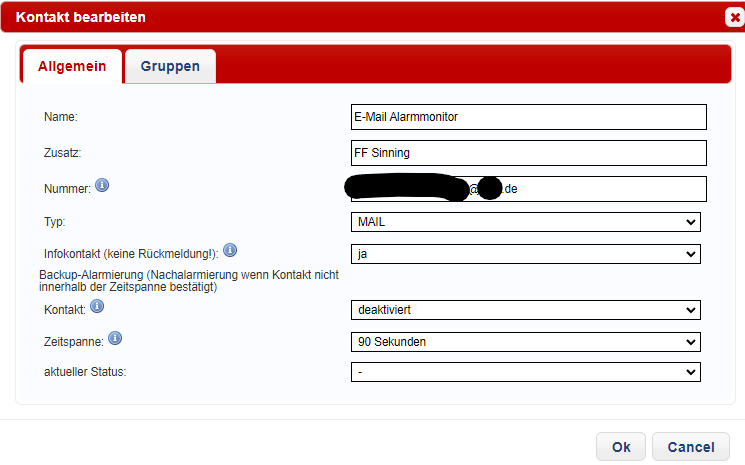

# Info

Dieses Alarmmonitorprogramm ist noch in der Entwicklung und nur ein Freizeitprojekt. Eventuelle Fehlfunktionen sind also möglich. 
Es sind noch nicht sehr viele Features vorhanden.

Neue Funktionen werden von Zeit zu Zeit auf Github veröffentlicht. Diese müssen momentan noch manuell aktualisiert werden. Wie dies funktioniert wird bei den Hinweisen am Ende erklärt. Geplante Funktionen sind ebenfalls am Ende erwähnt.


# Installationsvorraussetzungen

## E-Mail Adresse zum Empfang von E-Mails

Es wird eine E-Mail Adresse benötigt, um die Alarme zu empfangen. Ich empfehle, eine separate Mail Adresse zu verwenden, die nur für den Alarmmonitor genutzt wird.\
Googlemail bzw. gmail Postfächer funktionieren leider momentan noch nicht. Verwenden Sie stattdessen einen anderen Anbieter, wie z.B. gmx.\
Im E-Mail Postfach muss in den Einstellungen die Option aktiviert sein, dass die E-Mails über IMAP abgerufen werden dürfen.


## Alarmierungsmail nach folgendem Aufbau

Dieses Programm zeigt Alarmierungen an, die auf einer Mail Adresse im Textformat eingehen.

Die Alarmierungsmail muss wie Folgt aufgebaut sein:

```
Keyword; Inhalt
Keyword; Inhalt
...
```

Dieser Aufbau wird dann in einer tabellarischen Übersicht dargestellt.


## Alarmmail aus Poweralarm 

Eine Alarmierungsmail Mail kann zum Beispiel aus PowerAlarm erzeugt werden, sofern die eMID Schnittstelle verwendet wird.\
Nun wird in Poweralarm ein Benutzer angelegt, welcher als Nummer die Mail-Adresse hinterlegt hat und als Typ MAIL.



Als nächstes wird eine Gruppe für den Alarmmonitor erstellt. Der soeben erstellte Benutzer wird dieser Gruppe zugewiesen.\
Zu guter letzt wird noch ein Alarmgeber benötigt. Ihm wird die gerade erstellte Gruppe zu gewiesen und ein Text-Template, wie z.B. folgendes:

```
Schlagwort; [SCHLAGWORT]
Stichwort; [STICHWORT]
Bemerkung; [BEMERKUNG]
Strasse; [STRASSE]
Hausnummer; [HAUSNUMMER]
PLZ; [PLZ]
Ort; [ORT]
Ortsteil; [ORTSTEIL]
Abschnitt; [ABSCHNITT]
Mitteiler; [MITTEILER]
Mitteiler Kontakt; [MITTEILER_KONTAKT]
Objekt; [OBJEKT]
Einsatzmittel; [EINSATZMITTEL]
Latitude; [GPS_LAT]
Longitude; [GPS_LONG]
Alarmdatum; [ALARMDATUM]
*** Datum/Zeit:
```

Nun sollte bei jedem Einsatz eine Mail mit den oben genannten Details an die angegebene E-Mail Adresse versendet werden.


## Anforderungen an den Aufbau der Alarmmail

Die Adresse auf der Karte wird mithilfe des Breiten- und Längengrades angezeigt. Diese müssen als Keyword wie folgt vorkommen:

```
Latitude;
Longitude;
```

Die Werte für Breitengrad und Längengrad werden im Programm verarbeitet und nicht in der Tabellarischen Ansicht des Alarmmonitors mit dargestellt.\
Falls die Koordinatetn nicht vorhanden sind, wird versucht die Karte anhand der Adresse zu aktualisieren. Dazu müssen die folgenden Keywords in der genannten Reihenfolge vorhanden sein.\
Es dürfen dabei andere Keywords dazwischen vorkommen. Die Reihenfolge ist jedoch zu beachten.

```
Strasse; ...
Hausnummer; ...
PLZ; ...
Ort; ...
```

Um Platz auf der Anzeige zu sparen, wird die Adresse zusammengefasst angezeigt, wie z.B. Musterstraße 45a 55555 Musterstadt\
Wenn Sie den Aufbau anpassen möchten, kann die Verarbeitung der Inhalts zur Adresse in der Datei mail.py -> get_address_from_content angepasst werden.\
Falls die Adresse nicht aufgelöst werden kann, ändert sich an der Karte nichts. Der Text wird dennoch angezeigt.


# Raspberry Pi setup

Im Terminal:

```bash
sudo apt-get update && sudo apt-get upgrade
```

Klone das Git-Repo, oder lade die ZIP-Datei herunter und entpacke diese in einen Ordner deiner Wahl. Den Pfad zu dem Ordner werden wir später noch benötigen.


## Alarmmonitor Environment

Es muss eine alarmmonitor.env Datei im Root-Verzeichnis geben (selbe Ebene wie main.py).\
Die Datei wird nicht über das Git-Repo mit verteilt und muss somit manuell nach dem folgenden Muster erstellt und angepasst werden.

```
EMAIL_ADDRESS=deine.email@beispiel.com
EMAIL_PASSWORD=deinpasswort
IMAP_SERVER_ADDRESS=imap.beispiel.net

FILTER_EMAIL_SENDER=@beispiel2.com
FILTER_EMAIL_SUBJECT=Alarmierung

DEFAULT_LATITUDE=48.688687
DEFAULT_LONGITUDE=11.109092
```

DEFAULT_LATITUDE und -LONGITUDE sind die Koordinaten, welche standardmäßig auf der Karte angezeigt werden, falls keine Alarmierung vorliegt. Hier können z.B. die Koordinaten des eigenen Feuerwehrhauses oder ähnliches verwendet werden. Koordinaten können z.B. [hier](www.koordinaten-umrechner.de) aus der Adresse berechnet werden. 

Die Filterwerte werden benötigt, um nur die Mails zu verarbeiten, die auch eine Alarmierung beinhalten. Auch wenn eine separate Mail nur für den Alarmmonitor angelegt wurde, kommen Werbe- oder Spammails, welche nicht verarbeitet werden sollen.

Der Filter "FILTER_EMAIL_SENDER" muss mit einem Wert ausgefüllt werden, welcher in der Mail-Adresse des Alarmabsenders enthalten ist. Für Poweralarm als Alarmabsender kann z.B. @fitt-gmbh.de verwendet werden. Dieser Wert kann auch beliebig angepasst werden, um z.B. manuelle Alarmmails als Test zu schreiben und zu verarbeiten.\
Der Wert "FILTER_EMAIL_SUBJECT" ist mit einem Text auszufüllen, welcher im Betreff der Alarmmail zu finden ist. Bei Poweralarm z.B. Alarm.

Die Filterwerte sind so konzipiert, dass der angegebene Wert nur in der Mail bzw. dem Betreff vorkommen muss. Es muss keine exakte Übereinstimmung sein. So wird z.B. mit dem Filterwert "Alarm" auch das Wort "Alarmierung" abgedeckt. Bzw. der Filter @beispiel.com deckt sowohl test@beispiel.com ab, als auch hallo@beispiel.com.

Alle Filter Werte können auch leer sein. Dafür einfach neben dem '=' nichts ausfüllen.


## Bildschirmschoner deaktivieren:

Im Terminal mit 
```bash
sudo nano /etc/xdg/lxsession/LXDE-pi/autostart
```

Datei /etc/xdg/lxsession/LXDE-pi/autostart öffenen und folgende Zeilen hinzufügen:

```
@xset s off
@xset -dpms
@xset s noblank
```


## Virtuelle Umgebung erstellen: 

Hinweis: Der root folder des Alarmmonitors ist der Ordner, in dem die Datei main.py zu finden ist. 

Im Terminal:
```bash
cd /root-folder-of-alarmmonitor
python -m venv venv
source venv/bin/activate
pip install python-dotenv tkintermapview geopy
python main.py
```

Anwendung sollte gestartet haben
-> kann wieder beendet werden

Im selben Terminal (ansonsten wieder zum richtigen Pfad wechseln mit cd ...):
```bash
deactivate
```

## Autostart für Alarmmonitor

Nun wird das Alarmmonitor Programm so eingerichtet, dass es automatisch beim starten des Raspberry geöffnet wird (z.B. nach einem Stromausfall).

Im Terminal: 
```bash
Touch ~/Desktop/Alarmmonitor.sh
chmod +x Alarmmonitor.sh
```

-> erstellte Datei Alarmmonitor.sh bearbeiten und folgenden Inhalt einfügen. Dabei müssen die zwei Platzhalter "Usermane" und die zwei Platzhalter "Path-to-Alarmmonitor" ersetzt werden.

```
#!/bin/bash

sleep 15

LOGFILE=/home/*Usermane*/Desktop/alarmmonitor.log
echo "Cronjob started at $(date)" >> LOGFILE

export PATH=/usr/local/bin:/usr/bin:/bin:/usr/sbin:/sbin
export DISPLAY=:0

source /Path-to-Alarmmonitor/venv/bin/activate >> $LOGFILE 2>&1
python -u /Path-to-Alarmmonitor/main.py >> $LOGFILE 2>&1
deactivate
echo "Cronjob ended at $(date)" >> $LOGFILE
```

Im Terminal:
```bash
crontab -e
```

Zeile hinzufügen:
```
@reboot ~/Desktop/Alarmmonitor.sh &
```

Fertig :)


# Info

## Logdatei

Der Alarmmonitor legt eine sogenannte Logdatei an, in der einige Ereignisse dokumentiert werden, wie z.B. das empfangen einer neuen Mail, oder das verlieren der Internetverbindung. Diese Logdatei wird noch nicht automatisch geleert. Es empfiehlt sich diese von Zeit zu Zeit zu kontrollieren und ggf. zu löschen, oder alte Inhalte aus der Datei zu löschen.


## Mailempfang

Vom Mailserver werden alle Mails verarbeitet, die als ungelesen markiert sind. Diese werden anschließend als gelesen markiert. Es kann also zum testen eine schon vorhandene Mail einfach wieder als ungelesen markiert werden.


## Anwendung beenden

Da die Anwendung im Vollbildmodus läuft, ist es momentan noch nicht mit einem Mausklick möglich, diese zu minimieren oder zu schließen. 
Es kann allerdings die Windowstaste gedrückt werden, dann z.B. Terminal eingegeben werden und dieses geöffnet werden. Anschließend ist die Taskleiste zu sehen und mit einem Rechtsklick auf das Alarmmonitor Fenster kann dieses Minimiert oder geschlossen werden. Das Terminal kann anschließend auch wieder geschlossen werden.


## Updates

Für Updates sollte die Anwendung geschlossen sein.
Updates werden noch nicht automatisch installiert. Um dies manuell durchzuführen, können Sie die aktualisierten Dateien aus Github herunterladen und anschließend die vorhandenen Dateien durch die neuen ersetzten. Falls Sie mit git vertraut sind, können Sie einfach einen git pull durchführen.


## Geplante Features

Hier einige relevante Features, die für die Zukunft geplant sind:

- Anzeige auf Bildschirm, wenn Mails nicht aberufen werden können
- Hydranten auf der Karte einzeichnen
- Automatische Update Funktion
- Tabelle mit angezeigten Daten scrollbar machen
- Anzeige eines minimieren und schließen Buttons, wenn die Maus in die rechte Obere Ecke bewegt wird
- Standby Anzeige mit Uhrzeit, Wetter etc.

Weitere geplante Features sind in den Issues in Github zu finden